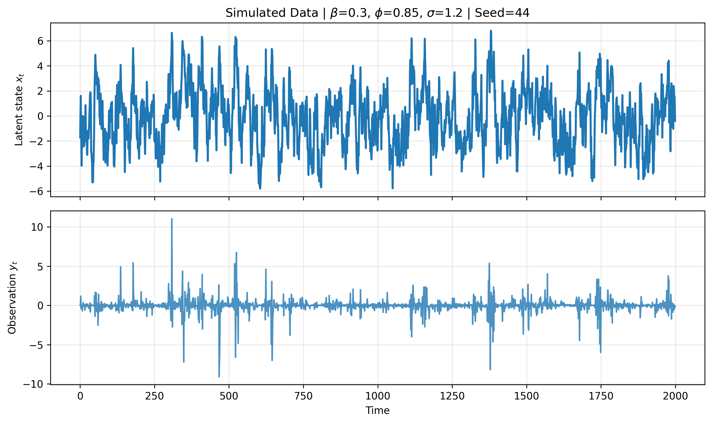
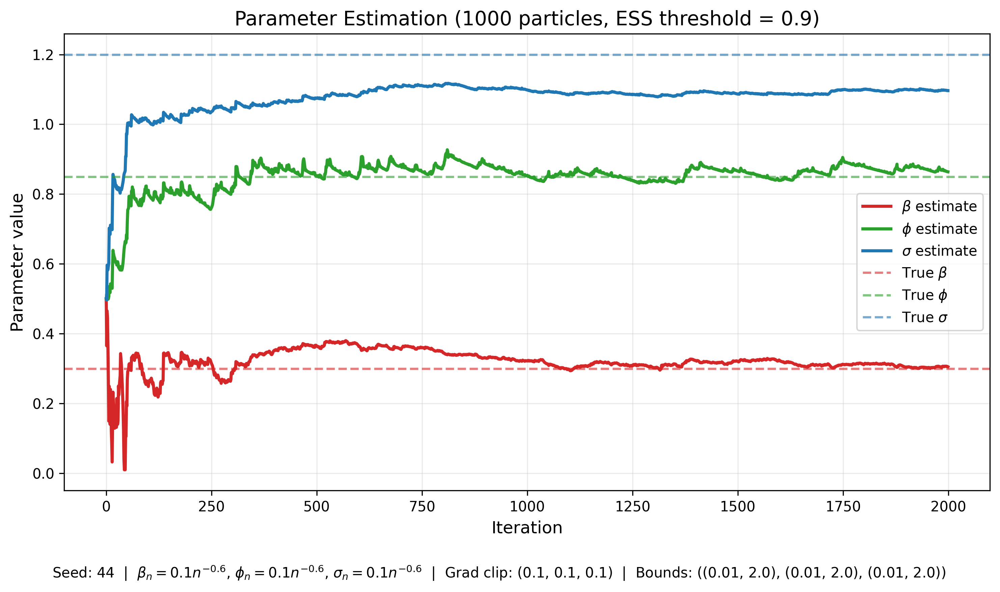

### Online Parameter Estimation Algorithm for a Stochastic Volatility Model
General state space models consist of a latent Markov process $(X_t)$ and an observated process $(Y_t)$. The state space model of concern for us is in discrete time and is a Stochastic Volatility Model defined by

$$ Y_t = \beta e^{X_t / 2} V_t $$

$$ X_{t+1} = \phi X_t + \sigma W_t $$

$$ V_t, W_t \sim \mathcal N(0,1) $$

In this model, $(X_t)$ is called the volatility process and $(Y_t)$ is its expression as a process of observed returns. Within online parameter estimation, we want to find the values of the parameters $\beta, \phi, \sigma$ that is generating the observed process $(Y_t)$ in an online manner. The algorithm implemented is from the scheme in [this paper](https://www.stats.ox.ac.uk/~doucet/Tadic_Doucet_particleMLE.pdf) but specialised to the above model.  

## Example of Simulated Data and Estimation Result
Simulated Data

Estimation Result
